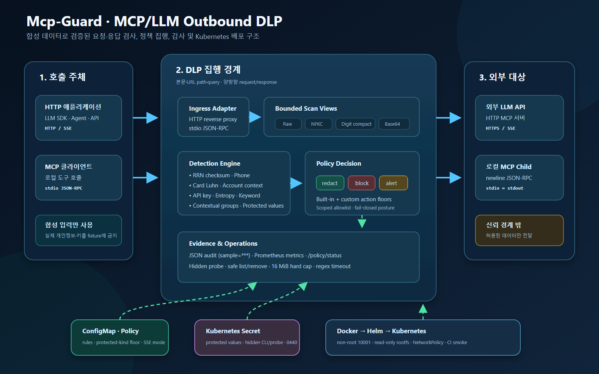

# Mcp-Guard

> 외부 LLM API와 MCP 서버로 나가는 요청·응답에서 한국 개인정보와 조직 기밀을
> 탐지하고 `redact`·`block`·`alert` 정책을 집행하는 Python outbound DLP proxy

HTTP reverse proxy와 newline-delimited stdio MCP adapter를 함께 제공한다. 모든 예제,
회귀 데이터, 배포 smoke test는 **가상·합성 데이터만 사용**한다. 실제 사용자·고객·직원
개인정보나 운영 API key를 fixture에 복사하지 않는다.



## 실측 결과

성능·배포는 2026-07-12, 전체 회귀와 레지스트리 안전장치는 2026-07-15 동일
workspace에서 재실행한 결과다. 자세한 방법·환경·실패 케이스는
[`실증 테스트 보고서`](docs/EMPIRICAL_REPORT.md)와 [`evidence`](docs/evidence/)에 있다.

| 지표 | 실측값 | 범위 |
|---|---:|---|
| 내장 탐지 회귀 | 양성 **35/35**, 정상 오탐 **0/14** | 합성 한국 PII·시크릿 fixture |
| 우회 코퍼스 recall | **16.667% → 93.333% (+76.666%p)** | sensitive 60건, raw-only 대비 enhanced |
| 우회 코퍼스 FPR | **0/30 → 0/30** | 고정 benign 30건 |
| enhanced scan 비용 | 평균 **+0.0440ms**, p95 **+0.0774ms** | 모드별 18,000 samples |
| HTTP proxy overhead | 평균 **+3.10ms**, p95 **+3.65ms** | 1,102B, 200 paired localhost runs |
| SSE event TTFB | 평균 **37.158ms → 4.892ms (-86.835%)** | 25ms gap, 모드별 100 runs |
| 전체 테스트 | **187 passed, 1 skipped** | 2026-07-16; skip은 Windows POSIX mode 전용 1건 |
| fresh 배포 | Helm `deployed`, 2 pods `1/1 Running` | Docker 29.6.1, k3d 5.8.3 |
| GitHub Actions 전체 CI/CD | **green**: test → GHCR push → k3d/Helm → curl smoke | [run #29484526417](https://github.com/ki0915/Mcp-Guard/actions/runs/29484526417), `workflow_dispatch`, 2026-07-16 |

이 수치는 저장소의 작은 합성 회귀셋과 로컬 환경에만 적용된다. “실서비스 탐지율
93.3%” 또는 “오탐 없음”으로 일반화하면 안 된다.

## 무엇을 보호하나

| 영역 | 탐지 방식 | 기본 정책 |
|---|---|---|
| 주민등록번호 | 날짜 타당성 + 고전 mod-11 checksum | checksum `block`, format-only `alert` |
| 전화번호 | 국내 휴대·지역·대표·`+82`; 일부 plain 형식은 phone 문맥 요구 | `redact` |
| 카드번호 | 14~16자리 + IIN 첫 숫자 + Luhn | `block` |
| 계좌번호 | 하이픈 그룹 10~14자리 + ±40자 은행/계좌 문맥 | `redact` |
| API key·시크릿 | 알려진 prefix, JWT/PEM, assignment + Shannon entropy | `block` |
| 문서 등급 | `대외비`, `CONFIDENTIAL`, `INTERNAL ONLY` 등 | `alert` |
| 조직 고유 정보 | literal/timeout regex/contextual groups | rule별 설정 |
| 실제 보호값 | Secret의 exact literal 또는 bounded token SHA-256 | `block`/`redact`; `alert` 금지 |

### 우회 표현 완화

탐지 전 원문 위치를 유지하는 파생 view를 만든다. 마스킹은 파생 문자열이 아니라 원래
입력의 안전한 범위에 적용된다.

- Unicode NFKC: 전각 숫자·문자·구두점
- 숫자 사이 whitespace/zero-width formatting control 축약
- 최대 길이·개수·총 decode byte가 제한된 UTF-8 Base64 1회 decode
- 여러 개념 그룹이 같은 bounded window에 있을 때만 동작하는 contextual matcher

90건 합성 전후 데이터셋은
[`tests/data/evasion_benchmark.json`](tests/data/evasion_benchmark.json)에 고정되어 있고,
CI 테스트가 confusion matrix와 residual 4건을 함께 검증한다.

## 처리 흐름

```text
HTTP app / MCP client
        │
        ├─ HTTP body · path · query · response
        └─ stdio newline JSON-RPC request · response
                       │
             bounded decode / scan views
                       │
       built-ins + custom + protected registry
                       │
              redact │ block │ alert
                       │
           external LLM / MCP child process
                       │
         masked JSON audit + Prometheus metrics
```

아키텍처 원본은 [`SVG`](docs/assets/architecture.svg), README용 이미지는
[`PNG`](docs/assets/architecture.png)다.

## 빠른 시작

저장소 루트에서 Python 3.12+를 사용한다.

```bash
python -m venv .venv
# Linux/macOS: source .venv/bin/activate
# PowerShell:   .\.venv\Scripts\Activate.ps1
pip install .[dev]
```

### HTTP proxy

```bash
# Linux/macOS
export DLP_UPSTREAM=https://api.example.com
python -m dlp_proxy

# PowerShell
$env:DLP_UPSTREAM = "https://api.example.com"
python -m dlp_proxy
```

클라이언트의 base URL을 `http://localhost:8080`으로 바꾼다. `/healthz`, `/metrics`,
`/policy/status`는 관리용 예약 경로다.

합성 curl 예시:

```bash
curl -X POST http://localhost:8080/v1/chat/completions \
  -H 'Content-Type: application/json' \
  -d '{"messages":[{"role":"user","content":"synthetic phone 010-0000-0000"}]}'
```

기본 정책이면 upstream에는 `[REDACTED:phone]`이 전달된다.

### stdio MCP adapter

HTTP를 사용하지 않는 MCP child를 no-shell subprocess로 감싼다.

```bash
dlp-stdio-proxy -- python -m example_mcp_server
```

stdin/stdout의 newline-delimited JSON-RPC 문자열 값을 양방향 검사한다. 차단된 request는
일반화된 JSON-RPC `-32099` 오류를 반환하고 notification은 폐기한다. 감사 로그와 child
stderr는 stderr로 분리해 프로토콜 stdout을 오염시키지 않는다.

### Docker + k3d + Helm

```bash
docker build -t dlp-proxy:0.1.0 .
docker build -t dlp-mock-upstream:0.1.0 mock_upstream

k3d cluster create dlp --wait
k3d image import dlp-proxy:0.1.0 dlp-mock-upstream:0.1.0 -c dlp

helm install dlp-proxy deploy/helm/dlp-proxy --wait
```

실제 보호값은 Helm `--set`이나 ConfigMap에 넣지 않는다. 미리 만든 Secret만 참조한다.

```bash
kubectl create secret generic dlp-protected-v1 \
  --from-file=protected-values.yaml=/secure/path/protected-values.yaml

helm install dlp-proxy deploy/helm/dlp-proxy \
  --set protectedValues.existingSecret=dlp-protected-v1 \
  --wait
```

실제 외부 API를 사용할 때는 bundled mock을 끈다.

```bash
helm install dlp-proxy deploy/helm/dlp-proxy \
  --set upstream=https://api.example.com \
  --set mockUpstream.enabled=false \
  --wait
```

## 정책 설정

비민감 정책은 [`configs/policy.yaml`](configs/policy.yaml)에 둔다.
어떤 설정 방식을 골라야 하는지는 [`사용자 정책 가이드`](docs/POLICY_GUIDE.md)에
literal·regex·contextual·보호값·예외의 선택 기준과 합성 예제가 정리되어 있다.

```yaml
default_action: alert
rules:
  rrn: block
  card: block
  secret: block
  phone: redact
  account: redact
  keyword: alert
scan:
  request: true
  response: true
  max_body_bytes: 1048576
  oversize_action: block
  unscannable_action: block
  sse_mode: buffer       # buffer | event
```

`event` SSE 모드는 complete event 하나를 검사한 뒤 즉시 중계한다. full-response buffering보다
TTFB를 줄이지만 event 경계를 넘는 분할 의미는 재조립하지 않는다.

고신뢰 내장 kind(`rrn`, `card`, `secret`)와 해당 rule override는 `alert`로 낮출 수 없다.
원문 전달을 막는 `block` 또는 `redact`만 허용하며, 오타 난 override 이름도 시작 시
거부한다. 사용자 정의 rule도 kind가 `rrn`, `card`, `secret`, `confidential`,
`policy_error`이면 같은 action floor를 적용한다. kind를 생략하면 기본값이
`confidential`이므로 `alert`는 거부된다. `/policy/status`의 `posture`와
`fail_open_controls`는 request/response scan off,
oversize/unscannable alert 같은 명시적 fail-open 상태를 비밀값 없이 보여준다.

### 사용자 정의 정보

| 설정 대상 | matcher | 저장 위치 |
|---|---|---|
| 고정된 비민감 분류어 | escaped `literal` | ConfigMap policy |
| 사번·계약번호처럼 값의 형식 | timeout `regex` | ConfigMap policy |
| 여러 개념이 가까이 있을 때만 기밀 | bounded `contextual` | ConfigMap policy |
| 실제 코드명·토큰·식별값 | exact literal 또는 token SHA-256 | 기존 Kubernetes Secret |

실제 기밀값을 `custom_rules.matcher.values`나 regex에 직접 넣지 않는다. ConfigMap과 Helm
release history에 남을 수 있기 때문이다.

#### Contextual rule

범용 의미 모델이 아니라, 운영자가 정한 모든 literal 그룹이 한 window 안에 등장할 때
동작하는 bounded matcher다. 입력 literal은 regex로 실행하지 않고 escape한다.

```yaml
custom_rules:
  - id: synthetic-merger-context
    kind: confidential
    action: block
    scope:
      directions: [request, response]
    matcher:
      type: contextual
      groups:
        - [SYNTH-ACQUISITION, SYNTH-MERGER]
        - [SYNTH-TARGET, SYNTH-CANDIDATE]
        - [SYNTH-COMPANY, SYNTH-VENDOR]
      window_chars: 160
      ignore_case: true
```

### Protected-value registry

실제 기밀값은 repository 밖의 Kubernetes Secret 파일에서만 읽는다. CLI는 hidden input과
원자적 `0600` POSIX 파일 쓰기를 지원한다. `alert`는 원문을 전달하므로 보호값에는
설정할 수 없고 `block` 또는 `redact`만 허용한다. Windows에서는 별도 파일 ACL을 제한해야
한다.

```bash
# 원문·확인값을 터미널에 표시하지 않고 입력
dlp-protected-values add-literal --file /secure/protected-values.yaml \
  --id project-code --action block --direction request --direction response

# 공백 없는 8~512자 토큰은 파일에 원문 대신 SHA-256과 길이만 저장
dlp-protected-values add-token --file /secure/protected-values.yaml \
  --id deploy-token --action block

# 값·digest 없이 안전한 운영 메타데이터만 조회
dlp-protected-values list --file /secure/protected-values.yaml

# 숨김 입력이 실제 정책에서 block/redact 되는지 원문 없이 확인
dlp-protected-values probe --file /secure/protected-values.yaml \
  --direction request --method POST --path /v1/chat

# ID로 정확히 한 항목만 검증 후 원자적으로 제거
dlp-protected-values remove --file /secure/protected-values.yaml \
  --section protected-values --id project-code
```

예제 스키마: [`configs/protected-values.example.yaml`](configs/protected-values.example.yaml)

## 감사와 운영 안전장치

- 모든 finding에 `rid`, 방향, kind, rule, action을 JSON Lines로 기록
- raw match 대신 항상 `sample="***"`; transform source만 비민감 metadata로 기록
- 보호값은 `alert` 금지; 숨김 등록·safe list·hidden probe·검증된 원자적 삭제
- RRN·카드·시크릿 및 사용자 정의 보호 kind는 non-forwarding action floor 강제
- `/policy/status`에서 `hardened`/`degraded`와 fail-open control 목록 제공
- CLI가 repository 내부 보호값 파일 생성을 기본 거부하고 production loader로 선검증
- body 최대 16MiB hard cap, query 16KiB/128 fields, finding 256개 상한
- custom regex 1~100ms timeout, zero-width/match flood는 `policy_error` 차단
- hop-by-hop 및 `Connection` 지목 header 제거
- Pod UID/GID 10001, non-root, read-only rootfs, no privilege escalation, capabilities drop
- protected Secret read-only `0440`, service-account token automount 비활성
- opt-in NetworkPolicy로 label 지정 client의 egress를 proxy + DNS로 제한

## 실증 재현

```bash
python scripts/accuracy_report.py
python scripts/improvement_report.py --rounds 200
python bench/bench.py 200
python bench/stream_bench.py 100
pytest -q
ruff check .
bandit -q -r dlp_proxy scripts mock_upstream -s B104
helm lint --strict deploy/helm/dlp-proxy
```

| 증거 | 파일 |
|---|---|
| 전체 방법·결론·이력서 문구 | [`docs/EMPIRICAL_REPORT.md`](docs/EMPIRICAL_REPORT.md) |
| 우회 confusion matrix·scan latency | [`improvement-report.json`](docs/evidence/improvement-report.json) |
| HTTP 200 paired runs | [`bench-result.json`](docs/evidence/bench-result.json) |
| SSE 100 runs/mode | [`stream-bench-result.json`](docs/evidence/stream-bench-result.json) |
| fresh k3d/Helm smoke | [`k8s-deploy-proof-20260712.txt`](docs/evidence/k8s-deploy-proof-20260712.txt) |
| 기밀 정책·레지스트리 14개 안전장치 | [`registry-guardrails-20260715.txt`](docs/evidence/registry-guardrails-20260715.txt) |
| GitHub Actions 전체 CI/CD | [`github-actions-full-cicd-20260716.txt`](docs/evidence/github-actions-full-cicd-20260716.txt) |
| 사용자 정의 보호 kind action floor | [`custom-protected-action-floor-20260716.txt`](docs/evidence/custom-protected-action-floor-20260716.txt) |
| 기술·보안 계약 | [`docs/SPECIFICATION.md`](docs/SPECIFICATION.md) |

## 이 도구가 막지 못하는 것

이 프로젝트는 완벽한 차단 제품이 아니다.

1. **범용 의미적 유출**: contextual rule은 등록 어휘에 의존한다. 문장으로 완전히
   바꾸거나 여러 request/event로 나누면 놓칠 수 있다.
2. **임의 변환**: Base64는 bounded 1-pass만 처리한다. 재귀 Base64, 암호화, 압축,
   임의 문자 치환과 자연어 숫자 표기 전반을 복원하지 않는다.
3. **오탐/미탐 trade-off**: slash 같은 모든 구분자를 제거하면 정상 번호를 과탐하므로
   숫자 축약 범위를 whitespace/format-control로 제한했다.
4. **프로토콜 범위**: HTTP header, WebSocket, 이미지·음성·PDF/OCR은 검사하지 않는다.
   stdio는 newline-delimited JSON-RPC만 지원한다.
5. **stream 경계**: event 모드도 complete SSE event까지 기다리며 event 간 재조립을 하지
   않는다. buffer 모드는 첫 token 지연이 더 크다.
6. **response 차단 시점**: response를 막아도 upstream에 이미 보낸 request는 회수할 수 없다.
7. **우회 경로**: 애플리케이션이 proxy를 사용하지 않으면 검사하지 못한다. egress
   firewall, NetworkPolicy, RBAC와 함께 사용해야 한다.

## 프로젝트 문서와 상태

- 명세: [`docs/SPECIFICATION.md`](docs/SPECIFICATION.md)
- 정책 설정 가이드: [`docs/POLICY_GUIDE.md`](docs/POLICY_GUIDE.md)
- 합성 데이터 정책: [`tests/data/README.md`](tests/data/README.md)
- CI/CD: [`.github/workflows/ci.yml`](.github/workflows/ci.yml)
- 전체 실증 실행: [GitHub Actions #29484526417](https://github.com/ki0915/Mcp-Guard/actions/runs/29484526417) — GHCR 이미지 실제 푸시, k3d/Helm 설치, 합성 curl smoke 성공
- Helm chart: [`deploy/helm/dlp-proxy`](deploy/helm/dlp-proxy)

방어 목적의 포트폴리오 프로젝트다. 현재 저장소에는 재사용 조건을 정하는 `LICENSE`가
아직 선택되지 않았으므로, 공개되어 있어도 별도 허가 없이 재사용 가능하다는 뜻은 아니다.
