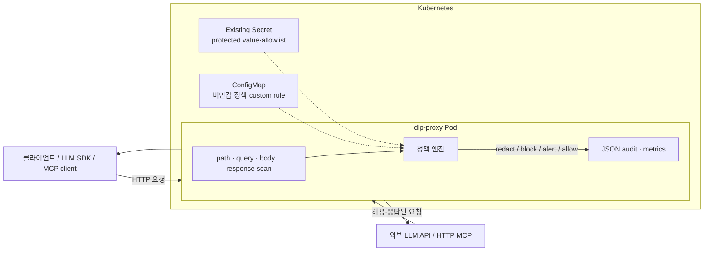

# dlp-proxy

> 외부 LLM API와 HTTP 기반 MCP 서버 앞에서 요청·응답을 검사하는 Python 아웃바운드
> DLP 리버스 프록시

한국 개인정보와 사내 기밀정보를 탐지해 정책에 따라 **마스킹(`redact`)**,
**차단(`block`)**, **감사만 수행(`alert`)**한다. 운영자는 비민감 형식 규칙과 실제
보호할 값을 직접 등록할 수 있으며, 실제 기밀값은 Helm values나 ConfigMap이 아니라
기존 Kubernetes Secret에서만 읽는다.

모든 예제·테스트·배포 증빙은 **가상·합성 데이터만 사용한다.** 사용자, 고객, 직원의
실제 개인정보나 운영 API key를 fixture에 복사하지 않는다.

## 한눈에 보기

| 항목 | 현재 구현 |
|---|---|
| 검사 지점 | 요청 본문, URL 경로, query key/value, 응답 본문 |
| 내장 탐지 | 주민등록번호, 전화번호, 카드번호, 계좌번호, API key/시크릿, 기밀 키워드 |
| 사용자 설정 | literal/시간 제한 regex, Secret literal/SHA-256 token, 만료형 exact allowlist |
| 기본 방어 | RRN·카드·시크릿 차단, 전화·계좌 마스킹, 대외비 키워드 감사 |
| 안전장치 | fail-closed, regex/finding/query/body 상한, masked audit, strict schema |
| 배포 | Docker, Helm, k3d/minikube, GitHub Actions → GHCR → k3d smoke test |
| 실측 | 내장 탐지 합성 양성 35/35, 오탐 0/14, 기본 정책 paired p95 +3.23ms |

이 도구는 의미 기반 DLP나 완전한 우회 방지 제품이 아니다. HTTP header, WebSocket,
stdio MCP, Base64·암호화, 여러 요청에 나뉜 유출, 프록시를 우회한 직접 연결은 막지 못한다.
[한계](#이-도구가-막지-못하는-것)를 도입 전에 반드시 확인해야 한다.

## 목차

- [빠른 로컬 데모](#빠른-로컬-데모)
- [아키텍처](#아키텍처)
- [탐지와 기본 정책](#탐지와-기본-정책)
- [사용자가 막을 정보 설정](#사용자가-막을-정보-설정)
- [기밀정보 안전하게 등록](#기밀정보-안전하게-등록)
- [Kubernetes 배포](#kubernetes-배포)
- [운영 안전장치와 관측](#운영-안전장치와-관측)
- [실측 결과](#실측-결과)
- [CI/CD](#cicd)
- [이 도구가 막지 못하는 것](#이-도구가-막지-못하는-것)
- [문서와 개발](#문서와-개발)

## 빠른 로컬 데모

필수 환경은 Python 3.12 이상이다. 기본 policy 경로가 repository 상대경로이므로 아래
명령은 repository root에서 실행한다. 다른 위치에서는 `DLP_POLICY_PATH`를 절대경로로
설정한다. 아래 요청은 합성 전화번호만 사용한다.

```bash
python -m venv .venv
source .venv/bin/activate              # PowerShell: .venv\Scripts\Activate.ps1
pip install -e ".[dev]"
```

터미널 1에서 가상 echo upstream을 실행한다.

```bash
python mock_upstream/server.py
```

터미널 2에서 프록시를 실행한다.

```bash
DLP_UPSTREAM=http://127.0.0.1:9000 python -m dlp_proxy
# PowerShell:
# $env:DLP_UPSTREAM="http://127.0.0.1:9000"; python -m dlp_proxy
```

터미널 3에서 프록시를 통과시킨다.

```bash
curl -sS -X POST http://127.0.0.1:8080/v1/chat/completions \
  -H 'Content-Type: application/json' \
  -d '{"messages":[{"role":"user","content":"가상 연락처 010-0000-0000"}]}'
```

응답의 upstream echo에는 원문 대신 다음 값이 들어간다.

```text
[REDACTED:phone]
```

체크섬 유효 합성 RRN, Luhn-valid test card, 합성 API key는 기본 정책에서 `403`으로
차단된다.

## 아키텍처



판정 순서는 다음과 같다.

1. 모든 내장·사용자 finding을 수집한다.
2. 허용 가능한 비보호 finding에 exact allowlist가 있는지 확인한다.
3. rule override → kind action → default action 순으로 정책을 결정한다.
4. 겹친 finding을 버리지 않고 전부 평가한다.
5. 하나라도 `block`이면 전체 요청/응답을 차단한다.
6. 차단이 없으면 겹친 redact span을 병합해 치환한다.

`policy_error`는 설정과 무관하게 항상 차단된다. regex timeout, zero-width match,
match/finding 폭증이 여기에 해당한다.

## 탐지와 기본 정책

| kind / rule | 검증 방식 | 기본 처리 |
|---|---|---|
| checksum-valid RRN 후보 | 날짜 + 고전 mod-11 checksum | `block` |
| checksum-invalid RRN 후보 | 날짜 + 형식만 확인 | `alert` |
| 전화번호 | 휴대전화·지역·대표번호·`+82` 형식 | `redact` |
| 카드번호 | 14~16자리, 첫 숫자 2/3/4/5/6/9 + Luhn | `block` |
| 계좌번호 | 하이픈 그룹 10~14자리 + ±40자 은행/계좌 문맥 | `redact` |
| API key·시크릿 | 알려진 prefix, JWT/PEM, 식별자 + entropy 3.5 | `block` |
| `대외비` 등 | 한국어·영어 분류 키워드 | `alert` |

프록시는 발급 시점을 판별하지 않는다. 날짜가 유효한 후보를 고전 checksum 결과로만
`rrn-checksum`/`rrn-format-only`로 나누므로 무작위 suffix가 우연히 checksum을 통과할
가능성도 있다. 공백 구분 RRN은 가격·수량 숫자열의 오탐을 줄이기 위해 주변 신원 문맥을 요구한다.
계좌번호도 ±40자 은행/계좌 문맥이 필요하다. 이 정밀도 선택은 문맥 없는 실제 값을
놓칠 수 있다.

지원 문자 디코딩은 Content-Type의 유효 charset과 UTF-8을 사용하며, charset이 없는
text/JSON/XML/form body는 cp949 폴백을 시도한다. 디코딩할 수 없거나 설정 크기를 넘는
본문은 기본적으로 fail-closed 차단한다.

## 사용자가 막을 정보 설정

공개 가능한 형식 규칙(사번, 문서 등급, 내부 티켓 형식)은
[`configs/policy.yaml`](configs/policy.yaml)의 `custom_rules`에 둔다.

```yaml
custom_rules:
  - id: employee-id
    description: 사번 형식
    kind: business_identifier
    action: redact
    scope:
      directions: [request, response]
      methods: [POST]
      path_prefixes: [/v1/hr]
    matcher:
      type: regex
      pattern: '\bEMP-[0-9]{8}\b'

  - id: classification-banner
    kind: document_classification
    action: alert
    matcher:
      type: literal
      values: [INTERNAL USE ONLY, 배포 금지]
      ignore_case: true
      whole_word: false
```

가능하면 `literal`을 선택한다. 사용자 regex는 시작 시 컴파일되며 rule당 기본 25ms,
최대 100 match, 전체 text당 256 finding으로 제한된다. 설정은 배포 전에 검증한다.

```bash
python scripts/validate_policy.py --policy configs/policy.yaml
```

전체 필드, 범위, 우선순위는
[`docs/SPECIFICATION.md`](docs/SPECIFICATION.md#42-사용자-정의-rule)에 정의되어 있다.

## 기밀정보 안전하게 등록

실제 코드명·계약번호·배포 토큰을 `values.yaml`, `--set`, ConfigMap, Git 저장소에
넣으면 안 된다. Helm은 release values를 cluster history에 보존한다.

숨김 입력 CLI는 다음 안전장치를 적용한다.

- 값과 확인값을 터미널에 표시하지 않음
- repository 내부 경로 저장을 기본 거부
- production loader로 검증한 뒤 atomic replace
- POSIX 파일 권한 `0600`(Windows는 별도 ACL 제한 필요)

```bash
# exact literal: 값은 두 번 숨김 입력
python scripts/protected_values_cli.py add-literal \
  --file /secure/dlp/protected-values.yaml \
  --id project-codename --action block \
  --direction request --direction response

# 공백 없는 고엔트로피 token: 원문 대신 SHA-256 + 정확한 길이 저장
python scripts/protected_values_cli.py add-token \
  --file /secure/dlp/protected-values.yaml \
  --id production-token --action block \
  --direction request --direction response
```

SHA-256 등록은 임의 substring 검색이 아니다. 문서화된 `ascii_token` 문자 경계와
정확한 길이에서만 작동한다. 코드명처럼 추측 가능한 값은 digest가 아니라 Secret
literal을 사용해야 한다.

비보호 detector의 매우 좁고 임시적인 오탐 예외만 allowlist할 수 있다.

```bash
python scripts/protected_values_cli.py add-allowlist \
  --file /secure/dlp/protected-values.yaml \
  --id approved-demo-phone \
  --target phone-mobile \
  --reason 'approved synthetic demo' \
  --expires-at 'YYYY-MM-DDTHH:MM:SS+09:00' \
  --direction request --method POST --path-prefix /demo
```

예외는 exact SHA-256 값, target rule, direction, method, path, 사유, timezone 포함 만료를
모두 요구한다. 최대 TTL은 30일이며 `rrn`, `card`, `secret`, `confidential`,
`policy_error`는 예외 처리할 수 없다.

## Kubernetes 배포

필수 도구는 Docker, k3d(또는 minikube), kubectl, Helm이다.

```bash
# 1. 로컬 이미지 빌드
docker build -t dlp-proxy:0.1.0 .
docker build -t dlp-mock-upstream:0.1.0 mock_upstream

# 2. cluster와 이미지 주입
k3d cluster create dlp --wait
k3d image import dlp-proxy:0.1.0 dlp-mock-upstream:0.1.0 -c dlp

# 3. 기본 합성 demo 배포
helm install dlp-proxy deploy/helm/dlp-proxy --wait

# 4. 접속
kubectl port-forward svc/dlp-proxy 18080:8080
```

실제 protected registry를 사용할 때 chart는 Secret을 만들지 않고 이름만 참조한다.

```bash
kubectl create secret generic dlp-protected-v1 \
  --from-file=protected-values.yaml=/secure/dlp/protected-values.yaml
kubectl patch secret dlp-protected-v1 --type=merge -p '{"immutable":true}'

helm upgrade --install dlp-proxy deploy/helm/dlp-proxy \
  --set protectedValues.existingSecret=dlp-protected-v1 \
  --wait
```

같은 Secret 내용을 제자리 수정하지 않는다. `dlp-protected-v2`처럼 새 immutable
Secret을 만들고 `helm upgrade`로 이름을 바꿔 rollout한다. Pod 안의 대상 파일은
read-only `0440`이며 권한이 더 넓으면 프록시가 시작을 거부한다.

실제 외부 endpoint를 사용한다.

```bash
helm upgrade --install dlp-proxy deploy/helm/dlp-proxy \
  --set mockUpstream.enabled=false \
  --set upstream=https://api.example.com \
  --set image.repository=ghcr.io/OWNER/REPO/proxy \
  --set image.tag=COMMIT_SHA \
  --wait
```

private registry는 `imagePullSecrets`, immutable 배포는 `image.digest`를 지원한다.

클러스터 내 우회를 제한하려면 `networkPolicy.enabled=true`로 설치하고 같은 release
namespace에서 보호할 client Pod에 `dlp-egress=via-proxy` label을 붙인다. NetworkPolicy를 실제 집행하는 CNI가
필요하며 DNS tunneling이나 label 변경 권한까지 해결하지는 않는다.

## 운영 안전장치와 관측

| 안전장치 | 동작 |
|---|---|
| strict config | unknown key, 문자열 boolean, 잘못된 action·digest·범위, 누락 파일 거부 |
| body control | 기본 1MiB, 설정 가능 범위 1B~16MiB, oversize/undecodable 기본 차단 |
| query/path | 16KiB·128 field 상한, dot segment/backslash/이중 slash 경로 거부 |
| regex budget | rule당 1~100ms, 100 match, text당 256 finding |
| audit privacy | 원문·prefix·digest 대신 `sample="***"` 기록 |
| Pod hardening | UID/GID 10001, non-root, read-only rootfs, no capabilities, RuntimeDefault seccomp |
| Secret handling | 명시된 기존 Secret만 사용, `0440`, service-account token 자동 마운트 안 함 |
| supply chain | base image digest, exact runtime lock, Dependabot, image digest 지원 |

관리 endpoint:

| endpoint | 용도 | 주의 |
|---|---|---|
| `GET /healthz` | 프로세스 liveness | upstream readiness는 확인하지 않음 |
| `GET /policy/status` | rule/예외 count와 fail mode | matcher·ID·digest·경로 미노출, `no-store` |
| `GET /metrics` | Prometheus counter | action/kind detector 신호가 있으므로 접근 제한 필요 |

감사 로그는 stdout JSON Lines다. `rid`로 한 요청의 `dlp.decision`, `dlp.control`,
`dlp.forward`를 연결한다. `DLP_AUDIT_FILE`을 설정하면 `0600` regular file로
미러링한다.

protected Secret은 선택 사항이다. 다만 `existingSecret` 또는 Secret 경로를 명시했다면
파일/key 누락은 시작 실패로 처리된다. 관리 endpoint에는 앱 자체 인증이 없다. 인터넷에 직접 노출하지 말고 Ingress,
NetworkPolicy 또는 별도 관리 프록시에서 제한해야 한다.

## 실측 결과

### 탐지 정확도

측정 명령:

```bash
python scripts/accuracy_report.py
```

2026-07-11 측정값이며 **이 저장소의 작은 합성 회귀셋에만 적용된다.**

| 테스트셋 | 통과/전체 | 결과 |
|---|---:|---:|
| 내장 한국 PII 양성·음성 control | 27/27 | 케이스 통과율 100.0% |
| 내장 시크릿 양성·음성 control | 14/14 | 케이스 통과율 100.0% |
| 정상 텍스트 오탐셋 | 14/14 | 케이스 단위 오탐 0.0% |

- 내장 탐지기 케이스 단위 탐지율: **100.0%** — 양성 35/35
- 내장 탐지기 케이스 단위 오탐률: **0.0%** — 정상 텍스트 0/14
- 전체 pytest 계약: **120 cases** — POSIX file-mode test는 Windows에서 skip

실서비스 recall/precision을 의미하지 않는다. 테스트셋과 탐지기가 같은 저장소에서
관리되어 낙관적 편향이 있으며 실제 트래픽의 결과는 더 나쁠 수 있다.

### 지연 오버헤드

측정 명령:

```bash
python bench/bench.py 200
```

로컬 HTTP/1.1 keep-alive, `custom_rules: []`, protected registry 미설정 기본 policy,
1,102-byte 합성 JSON, 각 경로 워밍업 20회 뒤 200회 paired 측정 결과다. 사용자 rule
수에 따른 성능을 대표하지 않는다.

| 경로 | 평균 | p50 | p95 |
|---|---:|---:|---:|
| mock upstream 직접 호출 | 0.73ms | 0.71ms | 0.92ms |
| 프록시 경유 | 3.40ms | 3.30ms | 4.08ms |
| **paired 오버헤드** | **+2.67ms** | **+2.59ms** | **+3.23ms** |

원본은 [`docs/evidence/bench-result.json`](docs/evidence/bench-result.json)에 있다.
본문 크기, rule 수, hardware, 실제 network에 따라 달라진다.

### Kubernetes 실증

fresh `helm install`, Pod Ready, 전화 마스킹, RRN·protected literal·SHA token 차단,
blocked request 전후 upstream counter 불변, Secret `0440`, non-root 실행을 확인했다.

전체 기록: [`docs/evidence/k8s-deploy-proof.txt`](docs/evidence/k8s-deploy-proof.txt)

## CI/CD

`.github/workflows/ci.yml`은 다음 순서로 실행된다.

```text
Ruff/Bandit → pytest/accuracy → policy/Helm validation
→ Docker build → main push 시 GHCR push
→ ephemeral k3d → immutable synthetic Secret → helm install
→ redact/block/non-leak smoke test → evidence artifact
```

PR에서는 build까지 검증하고, `main` push에서 image push와 k3d 배포 smoke test를
실행한다. workflow 권한은 기본 `contents: read`, image job만 `packages: write`다.

현재 로컬에서 pytest, Ruff, Bandit, actionlint, Helm strict lint, Docker build, k3d smoke
test를 통과했다. 원격 Actions run URL은 저장소 게시 후 실제 실행 결과로만 기록한다.

## 이 도구가 막지 못하는 것

1. **의미적 유출**  
   분류 패턴이 없는 인수 계획, 알고리즘, 고객 명단 같은 의미 기반 기밀은 통과한다.

2. **인코딩·변형 우회**  
   Base64, 암호화, 전각 숫자, 문자 사이 공백·개행, 자연어 숫자, 여러 요청 분할을
   일반적으로 복원하지 않는다. URL percent encoding과 charset 없는 cp949 textual
   body는 지원하지만 임의 변환을 정규화하는 계층은 아니다.

3. **오탐·미탐 trade-off**  
   계좌번호는 문맥을 요구해 문맥 없는 값을 놓칠 수 있다. 전화번호는 문맥 없이
   잡아 송장번호 같은 유사 값을 마스킹할 수 있다.

4. **주민등록번호 checksum 분류**  
   프록시는 발급 시점을 알지 못한다. 날짜가 유효하고 고전 checksum을 통과하면
   `rrn-checksum`, 아니면 `rrn-format-only`다. 후자의 기본값은 오탐 방지를 위해
   `alert`이므로 차단하려면 정책을 `block`으로 올려야 한다.

5. **스트리밍·대용량·바이너리**  
   scan-enabled SSE는 응답 완료 또는 body 상한까지 first-token 지연이 생긴다.
   oversize/undecodable를 `alert`로 낮추면 감사 후 무검사 통과한다.

6. **프록시 우회와 stdio MCP**  
   직접 외부로 연결하거나 WebSocket/stdio transport를 쓰면 가시권 밖이다. NetworkPolicy는
   일부 우회만 줄이며 OS/firewall/egress gateway 통제가 별도로 필요하다.

7. **header와 예약 경로**  
   요청·응답 header는 DLP 검사하지 않는다. `Authorization`, cookie 등은 hop-by-hop
   filtering 후 전달될 수 있다. `/healthz`, `/metrics`, `/policy/status`는 프록시가
   점유하므로 같은 upstream 경로로 전달할 수 없다.

8. **운영 plane**  
   관리 endpoint 인증, upstream readiness, hot reload, SIEM 보존 정책, etcd encryption,
   package hash/SBOM/image 서명은 이 repository 밖에서 구성해야 한다.

9. **문자열 기반 redaction**  
   JSON AST가 아니라 문자 span을 치환한다. 사용자 regex가 JSON 문법까지 가로질러
   match하면 upstream JSON을 손상시킬 수 있다. 응답 차단은 이미 upstream에 전달된
   요청을 되돌리지 못하고 client 쪽 재노출만 막는다.

## 문서와 개발

| 문서 | 내용 |
|---|---|
| [`docs/SPECIFICATION.md`](docs/SPECIFICATION.md) | 기능·보안·HTTP·정책·Helm·CI 규범 명세 |
| [`tests/data/README.md`](tests/data/README.md) | 합성 fixture 정책 |
| [`docs/evidence/k8s-deploy-proof.txt`](docs/evidence/k8s-deploy-proof.txt) | 실제 k3d/Helm 배포 증빙 |
| [`docs/evidence/bench-result.json`](docs/evidence/bench-result.json) | 성능 원본 |
| [`configs/policy.yaml`](configs/policy.yaml) | 로컬 policy 예제 |
| [`configs/protected-values.example.yaml`](configs/protected-values.example.yaml) | 합성 Secret schema 예제 |

개발 gate:

```bash
pip install -e ".[dev]"
pytest -q -p no:cacheprovider
python scripts/accuracy_report.py
python scripts/validate_policy.py \
  --protected-values configs/protected-values.example.yaml
ruff check .
bandit -q -r dlp_proxy scripts mock_upstream -s B104
helm lint --strict deploy/helm/dlp-proxy
python bench/bench.py 200
```

## 목적 및 사용 원칙

이 프로젝트는 개인정보·기밀정보의 **방어 목적 유출 방지** 도구다. 공격, 자격증명
수집, 우회 자동화 용도가 아니다. 탐지율을 과장하거나 “완벽 차단”이라고 표현하지
않으며, 합성 회귀셋과 실제 운영 효과를 구분한다.

공개 배포 전에는 조직의 라이선스 정책, 로그 보존·접근권한, 개인정보 영향평가,
upstream 약관을 별도로 검토해야 한다.
