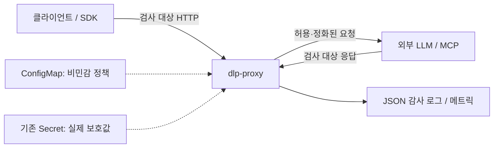

# dlp-proxy 기술·보안 명세서

| 항목 | 값 |
|---|---|
| 문서 상태 | 구현 기준(Implemented), 원격 Actions 증빙 Pending |
| 명세 버전 | 1.0 |
| 대상 애플리케이션 | `dlp-proxy` 0.1.x |
| 최종 검증일 | 2026-07-11 |
| 구현 언어 | Python 3.12+ |

이 문서는 외부 LLM API 또는 HTTP 기반 MCP 서버 앞에 배치하는 아웃바운드 DLP
리버스 프록시의 동작 계약을 정의한다. 구현과 명세가 충돌하면 테스트를 포함한 현재
구현을 우선 확인하고, 둘 중 하나를 같은 변경에서 바로잡아야 한다.

`MUST`, `MUST NOT`, `SHOULD`, `MAY`는 각각 필수, 금지, 권고, 선택 요구사항을 뜻한다.

## 1. 목적과 범위

### 1.1 목적

프록시는 다음 데이터가 HTTP 경계를 통해 외부 시스템으로 전송되거나 외부 응답에서
내부로 유입되는 것을 탐지하고 정책에 따라 처리해야 한다.

- 한국 개인정보: 주민등록번호, 전화번호, 카드번호, 계좌번호
- 인증정보: 알려진 형식의 API 키·토큰, PEM 개인키 표식, 고엔트로피 시크릿
- 문서 분류정보: `대외비`, `CONFIDENTIAL`, `INTERNAL ONLY` 등
- 운영자가 등록한 비민감 형식 규칙과 실제 기밀 literal/SHA-256 토큰

### 1.2 지원 범위

- HTTP/1.1 기반 LLM API와 일반 request/response형 HTTP MCP endpoint
- 요청 본문, URL 경로, query key/value, 응답 본문
- `GET`, `POST`, `PUT`, `PATCH`, `DELETE`, `HEAD`, `OPTIONS`
- UTF-8, 명시된 유효 charset, charset 미지정 textual body의 cp949 폴백
- Docker 컨테이너와 Kubernetes/Helm 배포

### 1.3 비범위

- WebSocket·stdio MCP transport와 TRACE/CONNECT
- TLS를 프록시 밖에서 직접 종료하는 클라이언트의 우회 트래픽
- 이미지·음성·PDF/OCR 등 바이너리 내용 분석
- 의미 기반 분류, 사용자 의도 판별, 여러 요청에 나뉜 정보의 재조립
- Base64·암호화·난독화·자연어 숫자 표기 전반의 자동 복원
- HTTP request/response header의 DLP 검사
- SSE/토큰 스트림을 실시간으로 정화하면서 지연 없이 중계하는 기능

## 2. 신뢰 경계와 위협 모델



다음 구성요소는 신뢰한다.

- 정책과 Secret을 배포할 권한이 있는 운영자
- Kubernetes API/RBAC와 Secret 저장 계층
- 프록시 이미지 및 Python 의존성 공급망
- 감사 로그를 수집·보존하는 플랫폼

다음 위협을 완화한다.

- 사용자의 실수로 프롬프트에 개인정보·토큰·내부 코드명을 붙여 넣는 경우
- 응답에 시크릿이 섞여 클라이언트로 돌아오는 경우
- 모호한 URL 경로, 과도한 query, regex 폭주, finding/log 폭증을 이용한 자원 고갈
- Helm values/ConfigMap/release history에 실제 보호값이 남는 운영 실수

결정적으로 우회하려는 내부 공격자를 완전히 차단하는 제품은 아니다. 네트워크 강제,
인증, 키 관리, SIEM, egress firewall과 함께 사용해야 한다.

## 3. 기능 요구사항

| ID | 요구사항 |
|---|---|
| FR-001 | 프록시는 지원 HTTP method의 요청을 설정된 upstream으로 전달해야 한다. |
| FR-002 | 활성화된 방향의 경로·query·본문과 응답 본문을 검사해야 한다. |
| FR-003 | 모든 겹치는 finding을 정책 평가하고, 하나라도 비예외 `block`이면 전체 메시지를 차단해야 한다. |
| FR-004 | `redact` span은 겹침을 병합한 뒤 `[REDACTED:<kind>]`로 교체해야 한다. |
| FR-005 | `alert` finding은 원문을 변경하지 않고 감사 기록만 남겨야 한다. |
| FR-006 | 사용자 custom rule은 앱/정책 인스턴스별로 격리되어야 한다. |
| FR-007 | 실제 기밀값은 선택된 기존 Secret 파일에서만 로드해야 하며 Helm chart가 Secret을 생성해서는 안 된다. |
| FR-008 | 허용 예외는 exact digest, 대상 rule, 명시적 방향, method, path, 사유, 만료가 모두 일치해야 한다. |
| FR-009 | 모든 finding과 fail-open/fail-closed 통제 판정을 구조화 감사 로그로 남겨야 한다. |
| FR-010 | 유효하지 않은 정책·Secret은 애플리케이션 시작 전에 거부해야 한다. |
| FR-011 | 운영 상태는 원문·matcher·digest·Secret 경로 없이 count와 fail mode만 제공해야 한다. |

## 4. 탐지 계약

### 4.1 내장 탐지기

| kind | 핵심 검증 | 기본 action | 주요 한계 |
|---|---|---|---|
| `rrn` | 날짜 타당성, 고전 mod-11 checksum; 공백 구분형은 신원 문맥 필요 | checksum `block`, format-only `alert` | 발급 시점은 판별하지 않으며 무작위 suffix가 우연히 checksum을 통과할 수 있음 |
| `phone` | 국내 휴대전화·지역·대표번호 및 `+82` 형식 | `redact` | 같은 숫자 형식의 다른 식별자를 과탐 가능 |
| `card` | 14~16자리, 첫 숫자 2/3/4/5/6/9, Luhn checksum | `block` | 토큰화·분할 카드번호 미탐 가능 |
| `account` | 하이픈 그룹 10~14자리 + ±40자 은행/계좌 문맥 | `redact` | 문맥 없는 계좌번호 미탐 가능 |
| `secret` | 알려진 prefix, JWT/PEM, 식별자 할당 + Shannon entropy 3.5 | `block` | 알려지지 않은 저엔트로피 시크릿 미탐 가능 |
| `keyword` | 한국어·영어 문서 분류 키워드 | `alert` | 키워드 없는 의미적 기밀 미탐 |

내장 rule 이름과 kind 매핑의 구현 기준은
[`dlp_proxy/policy.py`](../dlp_proxy/policy.py)와
[`dlp_proxy/detectors/`](../dlp_proxy/detectors/)이다.

### 4.2 사용자 정의 rule

비민감 형식 분류자는 policy ConfigMap의 `custom_rules`에 둔다. 실제 프로젝트 코드명,
계약번호, 운영 토큰은 이 영역에 넣지 않고 4.3의 protected registry를 사용해야 한다.

```yaml
custom_rules:
  - id: employee-id
    description: 사번 형식
    kind: business_identifier
    action: redact
    scope:
      directions: [request, response]
      methods: [POST]
      path_prefixes: [/v1/hr]
    matcher:
      type: regex
      pattern: '\bEMP-[0-9]{8}\b'
```

| 항목 | 계약 |
|---|---|
| 최대 rule 수 | 64 |
| `id` | `^[a-z][a-z0-9._-]{0,63}$`, 중복 금지 |
| `action` | `redact`, `block`, `alert` 중 하나 |
| 방향 | `request`, `request-path`, `request-query`, `response` |
| method | 대문자 3~10자 |
| path prefix | `/` 시작, 최대 256자, segment 경계 일치 |
| literal | rule당 1~100개, 각 3~512자, regex escape 적용 |
| regex | 1~512자, 선택적 대소문자 무시 |
| 실행 상한 | rule당 1~100ms 설정, 최대 100 match |
| 전체 finding 상한 | text당 256개; 초과 시 `policy_error`로 차단 |

zero-width match, regex timeout, match/finding 상한 초과는 단일 `policy_error`가 되며
사용자가 `alert`를 지정했어도 `block`으로 강제한다.

### 4.3 protected-value registry

실제 기밀정보는 repository 밖의 YAML을 숨김 입력 CLI로 만들고 기존 Kubernetes Secret의
파일로 마운트한다.

```yaml
version: 1
protected_values:
  - id: project-codename
    action: block
    literal: <Secret에만 저장되는 원문>
    scope:
      directions: [request, response]

  - id: production-token
    action: block
    sha256: <64자리 hex digest>
    token:
      charset: ascii_token
      length: 32
allowlist: []
```

| 항목 | 계약 |
|---|---|
| 최대 항목 수 | 512 |
| literal | 8~512자, text 안의 exact character-sequence substring, 선택적 `ignore_case` |
| SHA-256 | 64자리 hex + `ascii_token` + 정확한 길이(8~512) 필수 |
| SHA 후보 문자 | `A-Z a-z 0-9 _ . / + = : @ # $ % ! ? ~ -` |
| kind | 항상 `confidential` |
| 중복 | 같은 literal/digest material 금지 |
| reload | 시작 시 1회 로드; 변경은 새 versioned Secret과 rollout 필요 |

SHA-256 방식은 임의 substring을 역검색하지 않는다. 공백 없는 bounded token에만 적합하며,
저엔트로피 값은 digest 사전대입 위험이 있으므로 Secret literal을 사용해야 한다.

### 4.4 allowlist 계약

allowlist는 보호 kind가 아닌 오탐을 좁고 일시적으로 예외 처리할 때만 사용한다.

| 항목 | 요구사항 |
|---|---|
| 최대 항목 수 | 128 |
| 값 | 원문의 SHA-256 exact digest |
| `targets` | 존재하는 detector rule 1개 이상; wildcard 금지 |
| 금지 kind | `rrn`, `card`, `secret`, `confidential`, `policy_error` |
| scope | 최소 1개 direction + 최소 1개 method + 최소 1개 path prefix |
| `reason` | 3~200자, 개행 금지 |
| `expires_at` | timezone 필수, 로드 시점 기준 최대 30일 |
| 감사 | action=`allow`와 비민감 exception ID 기록 |

조건은 모두 AND로 평가한다. 하나라도 다르거나 만료 시각과 같거나 늦으면 예외는 비활성이다.

## 5. 정책 계약

### 5.1 판정 우선순위

1. exact allowlist가 허용되는 비보호 finding인지 평가한다.
2. 예외가 없으면 rule override를 확인한다.
3. 없으면 kind action을 확인한다.
4. 없으면 `default_action`을 적용한다.
5. `policy_error`는 어떤 설정보다 우선해 `block`한다.
6. 모든 겹침을 평가한 뒤 하나라도 `block`이면 redact보다 먼저 전체를 차단한다.

### 5.2 policy YAML

| 필드 | 타입/범위 | 필수 | 설명 |
|---|---|---|---|
| `version` | `1` | 예 | 스키마 버전 |
| `strict_config` | boolean | 예 | unknown key 거부; Helm에서는 반드시 `true` |
| `upstream` | credential 없는 HTTP(S) URL | 예 | `DLP_UPSTREAM`으로 런타임 대체 가능 |
| `default_action` | action | 예 | 미지정 kind의 기본 판정 |
| `rules` | kind→action | 예 | `rrn`, `card`, `secret` 명시 필수 |
| `rule_overrides` | rule→action | 아니오 | kind보다 우선 |
| `scan.request` | boolean | 예 | 요청 검사 |
| `scan.response` | boolean | 예 | 응답 검사 |
| `scan.max_body_bytes` | 1~16,777,216 | 예 | 기본 1,048,576 |
| `scan.oversize_action` | `block`/`alert` | 예 | `alert`는 무검사 통과 위험 수용 |
| `scan.unscannable_action` | `block`/`alert` | 예 | `alert`는 무검사 통과 위험 수용 |
| `expose_block_detail` | boolean | 아니오 | 403에 kind 포함; 기본 `false` |
| `custom_regex_timeout_ms` | 1~100 | 아니오 | 기본 25 |
| `custom_rules` | array | 아니오 | 4.2 참조 |

정확한 Helm 입력 스키마는
[`deploy/helm/dlp-proxy/values.schema.json`](../deploy/helm/dlp-proxy/values.schema.json)이
machine-readable source of truth다.

## 6. HTTP 계약

### 6.1 관리 endpoint

| method/path | 성공 응답 | 계약 |
|---|---|---|
| `GET /healthz` | `200 {"status":"ok"}` | 프로세스 liveness; upstream 준비상태는 보장하지 않음 |
| `GET /policy/status` | `200` JSON | 비민감 count/fail mode, `Cache-Control: no-store` |
| `GET /metrics` | `200` text | Prometheus exposition |

세 경로는 프록시가 점유하는 예약 endpoint이며 같은 upstream 경로로 전달할 수 없다.

관리 endpoint에는 애플리케이션 인증이 없다. 외부 인터넷에 노출해서는 안 되며
Ingress/NetworkPolicy/관리 프록시에서 접근을 제한해야 한다.

### 6.2 프록시 오류

| 조건 | HTTP | `error` |
|---|---:|---|
| 모호한 경로 정규화 | 400 | `dlp_ambiguous_path` |
| DLP finding 차단(요청/응답) | 403 | `dlp_blocked` |
| 응답 본문 크기 초과 차단 | 403 | `dlp_body_too_large` |
| 응답 디코딩 실패 차단 | 403 | `dlp_unscannable_body` |
| 요청 본문 크기 초과 차단 | 413 | `dlp_body_too_large` |
| query 상한 초과 | 414 | `dlp_query_too_large` |
| 요청 본문 디코딩 실패 차단 | 415 | `dlp_unscannable_body` |
| upstream 연결/응답 중단 | 502 | `upstream_unreachable` |

오류 body는 원문, matcher, digest, Secret 경로를 포함해서는 안 된다.

### 6.3 URL·본문 제한

- query raw UTF-8 크기는 최대 16KiB, field는 최대 128개다.
- path는 최대 5회 percent decode해 정책과 forwarding에 같은 canonical text를 사용한다.
- dot segment(`.`/`..`), backslash, 이중 slash, control character, decode round 초과는 거부한다.
- 요청은 설정 상한까지만 buffer하고, `alert`로 허용된 oversize 요청은 replay stream으로 보낸다.
- 응답은 디코딩된 bytes를 64KiB chunk로 상한+1 chunk까지만 읽는다.
- scan이 꺼졌거나 oversize `alert`인 응답은 무검사 stream으로 중계한다.
- `scan.request=false`여도 query/body hard control은 적용되지만 path/query/body detector는
  실행하지 않는다. `scan.response=false`이면 response cap/decoding control 없이 stream한다.
- httpx가 압축을 해제하므로 `content-encoding`은 제거하고 `content-length`는 재계산한다.

### 6.4 header 처리

request/response header는 DLP 검사 대상이 아니다. 고정 hop-by-hop 목록, `Connection`
header가 지목한 field, `host`,
`content-length`는 upstream으로 전달하지 않는다.
응답에서도 hop-by-hop, 기존 `content-encoding`, `content-length`를 제거한다. 그 밖의
end-to-end header와 반복 header(`Set-Cookie` 등)는 보존한다.

## 7. 감사·관측 계약

### 7.1 감사 로그

stdout에 JSON Lines로 기록하고 `DLP_AUDIT_FILE`이 있으면 선택적으로 미러링한다.
POSIX 파일은 `0600`, regular-file, no-follow 방식으로 연다.

| event | 주요 필드 |
|---|---|
| `dlp.decision` | timestamp, rid, direction, method, path, client, kind, rule, sample=`***`, action, optional exception ID |
| `dlp.control` | rid, direction, method, path, control, action |
| `dlp.forward` | rid, method, path, upstream status, duration_ms |

감사 로그는 raw match, prefix sample, digest, matcher, exception reason을 기록해서는 안 된다.
탐지된 path span은 마스킹하지만 비탐지 path는 그대로 기록된다. client IP·route·rule ID는
운영 메타데이터이므로 로그 접근권한과 보존기간을 별도로
통제해야 한다.

### 7.2 메트릭

- `dlp_decisions_total{action,kind}`
- `dlp_events_total{event}`

메트릭 label에 raw value나 사용자 matcher를 넣어서는 안 된다.

## 8. 보안 요구사항

| ID | 요구사항 |
|---|---|
| SR-001 | matched raw value와 앞부분 sample을 로그·오류·status에 노출하지 않는다. |
| SR-002 | 지원 Helm 배포의 `strict_config=true`에서 policy/명시된 Secret 파일 누락·파싱 실패·unknown 보안 옵션은 시작 실패로 처리한다. |
| SR-003 | oversize와 undecodable body의 기본 action은 `block`이다. |
| SR-004 | regex timeout/zero-width/match flood는 fail-closed다. |
| SR-005 | 실제 보호값을 Helm values, CLI `--set`, ConfigMap, chart 생성 Secret에 넣지 않는다. |
| SR-006 | protected Secret volume은 read-only `0440`, non-optional로 마운트한다. |
| SR-007 | Pod는 UID/GID 10001, non-root, read-only rootfs, no privilege escalation, all capabilities drop, RuntimeDefault seccomp로 실행한다. |
| SR-008 | service-account token은 자동 마운트하지 않는다. |
| SR-009 | policy와 protected rule state는 프로세스 인스턴스 사이에서 mutable global로 공유하지 않는다. |
| SR-010 | Container runtime 의존성은 exact lock을 사용하고 이미지 배포는 가능하면 digest로 고정한다. |

Kubernetes Secret은 Base64 인코딩일 뿐 암호화가 아니다. 운영 cluster는 etcd encryption
at rest, 최소 RBAC, Secret 조회 감사, External Secrets 또는 Secrets Store CSI를 사용해야 한다.

## 9. Kubernetes·Helm 계약

- chart는 proxy Deployment/Service/ConfigMap과 선택적 mock upstream을 생성한다.
- chart는 `kind: Secret`을 생성하지 않는다.
- protected registry는 선택 사항이며 `protectedValues.existingSecret`가 비어 있으면 마운트하지 않는다.
- 값이 있으면 지정 Secret/key가 없을 때 Pod가 Ready가 되어서는 안 된다.
- policy ConfigMap 변경은 checksum annotation으로 rollout한다.
- protected Secret은 같은 이름으로 수정하지 않고 immutable versioned name을 사용해야 한다.
- private registry는 `imagePullSecrets`, immutable image는 `image.digest`를 사용할 수 있다.
- opt-in NetworkPolicy는 `dlp-egress=via-proxy` client가 proxy와 cluster DNS로만 egress하도록
  제한하지만, label 변경 권한·DNS tunneling·hostNetwork 우회까지 막지는 않는다.

## 10. CI/CD 계약

PR에서는 lint/test와 image build(no push)를 수행한다. `main` push에서는 같은 gate 뒤
GHCR push와 k3d 배포까지 다음 순서로 수행한다.

1. Python 설치와 개발 의존성 설치
2. Ruff 및 Bandit(`dlp_proxy`, `scripts`, `mock_upstream`)
3. 전체 pytest와 합성 정확도 리포트
4. policy/protected-values validator
5. strict Helm lint와 보안 스키마 negative test
6. proxy/mock Docker build
7. main push에서 GHCR push
8. ephemeral k3d cluster, synthetic immutable Secret, `helm install`
9. clean pass, phone redact, RRN/protected literal/SHA token block
10. blocked request 전후 mock upstream counter 불변과 로그/manifest 원문 비노출 검증
11. 배포 증빙 artifact 업로드

GitHub Actions는 최소 `contents: read`를 기본으로 하고 image push job만 `packages: write`를
가져야 한다.

## 11. 검증·합격 기준

| 기준 | 검증 명령/증빙 | 현재 기준값 |
|---|---|---|
| 내장 탐지 회귀 | `python scripts/accuracy_report.py` | 케이스 단위 양성 35/35, 오탐 0/14(합성 fixture 한정) |
| 회귀 테스트 | `pytest -q` | 120 cases; POSIX mode test는 Windows에서 skip |
| 배포 재현 | [`docs/evidence/k8s-deploy-proof.txt`](evidence/k8s-deploy-proof.txt) | fresh Helm install, Ready, 실제 redact/block |
| 성능 | `python bench/bench.py 200` | paired 평균 +2.67ms, p95 +3.23ms |
| 정적/패키지 | Ruff, Bandit, actionlint, Helm strict lint, Docker build | 모두 통과 필요 |
| CI 실행 | GitHub Actions run URL과 artifact | 원격 저장소 게시 후 README에 기록 |

정확도 숫자는 이 저장소의 작은 합성 회귀셋에만 적용되며 실서비스 성능을 보장하지 않는다.

## 12. 테스트 데이터 정책

- 실제 사용자·고객·직원 개인정보를 fixture로 복사해서는 안 된다.
- 운영 API key, production prompt/log, 유출 사고 원문을 저장소에 넣어서는 안 된다.
- 주민번호 fixture는 checksum 수학만 검증하는 all-zero serial 합성값을 사용한다.
- 전화·계좌는 zero/nine-heavy placeholder, 카드는 payment-network test number를 사용한다.
- 토큰은 `SYNTH-*`, `EXAMPLE`처럼 비운영임이 명백한 값만 사용한다.
- 새로운 fixture는 [`tests/data/README.md`](../tests/data/README.md)의 정책을 따라야 한다.

## 13. 알려진 한계와 운영 결정

1. 의미적 유출과 여러 요청에 나뉜 유출은 탐지하지 못한다.
2. Base64, 전각 문자, 자연어 숫자, 임의 정규화·암호화는 우회할 수 있다.
3. 전화·계좌·entropy threshold에는 오탐/미탐 trade-off가 있다.
4. 발급 시점은 판별하지 않으며 format-only RRN 후보의 기본 `alert`는 값을 통과시킨다.
5. scan-enabled SSE는 응답 완료 또는 body 상한까지 first-token 지연이 발생한다.
6. HTTP header는 검사하지 않으며 예약 관리 경로는 upstream으로 전달할 수 없다.
7. 관리 endpoint는 인증이 없고 upstream readiness를 확인하지 않는다.
8. 정책과 Secret은 hot reload하지 않는다. versioned Secret + rollout이 필수다.
9. 앱이 프록시를 우회하면 검사할 수 없다. 네트워크 계층 강제가 별도로 필요하다.
10. exact dependency lock은 있지만 package hash lock, SBOM 서명, 이미지 서명은 별도다.
11. 응답 차단은 이미 upstream에 전송된 요청을 되돌리지 못하며 client 재노출만 막는다.

## 14. 구현 추적성

| 영역 | 구현 | 주요 테스트 |
|---|---|---|
| HTTP proxy/control | [`dlp_proxy/app.py`](../dlp_proxy/app.py) | [`tests/test_proxy.py`](../tests/test_proxy.py) |
| policy/allowlist | [`dlp_proxy/policy.py`](../dlp_proxy/policy.py) | [`tests/test_policy.py`](../tests/test_policy.py) |
| custom/protected | [`dlp_proxy/custom_rules.py`](../dlp_proxy/custom_rules.py) | [`tests/test_custom_policy.py`](../tests/test_custom_policy.py) |
| protected CLI | [`scripts/protected_values_cli.py`](../scripts/protected_values_cli.py) | [`tests/test_protected_values_cli.py`](../tests/test_protected_values_cli.py) |
| built-in detectors | [`dlp_proxy/detectors/`](../dlp_proxy/detectors/) | [`tests/test_detectors.py`](../tests/test_detectors.py) |
| Kubernetes | [`deploy/helm/dlp-proxy/`](../deploy/helm/dlp-proxy/) | Helm lint + k3d smoke evidence |
| CI/CD | [`.github/workflows/ci.yml`](../.github/workflows/ci.yml) | actionlint + GitHub Actions run |

## 15. 변경 관리

다음 변경은 명세·테스트·README를 같은 PR에서 갱신해야 한다.

- detector pattern, checksum, entropy threshold, context window 변경
- action precedence, protected kind, allowlist 조건 변경
- body/query/rule/finding 상한 변경
- HTTP status/error schema 변경
- policy/Secret/Helm values schema 변경
- 감사 로그·metric label 변경
- 측정 fixture, benchmark 방법, 기록 숫자 변경
